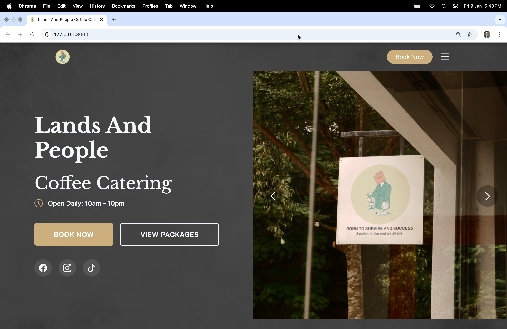
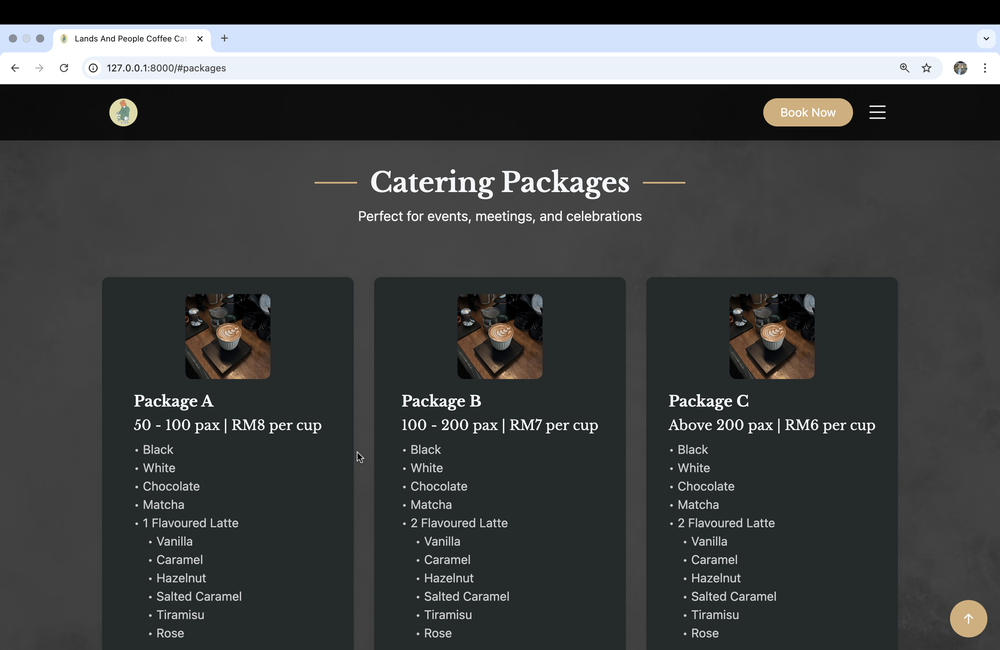
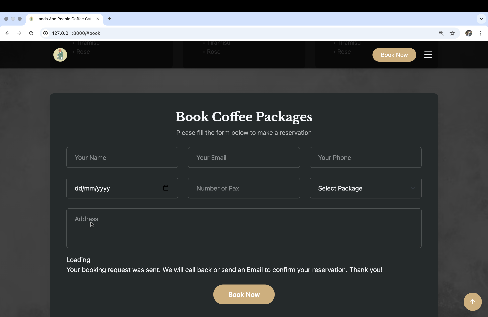
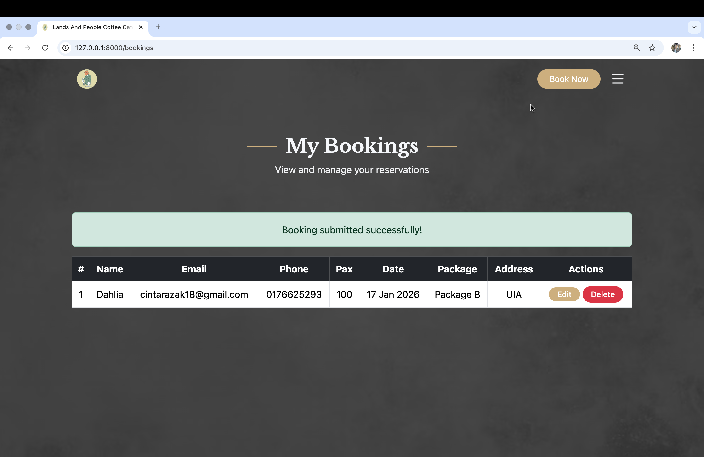

# Coffee Catering Reservation System

## Introduction
The growth of small catering businesses has increased the need for an efficient reservation system, as many businesses still rely on manual bookings through phone calls or walk-ins. This often leads to issues such as lost reservations, pricing miscalculations and double bookings.

To address these problems, the Coffee Catering Reservation System was developed for Lands & People Cafe. This web-based system simplifies the reservation process by allowing users to choose predefined coffee catering packages based on their budget and event requirements.

---

## Objectives
The objectives of this system are:
1. To digitalize the reservation process by replacing manual phone-based booking with an online platform.
2. To provide users with a seamless reservation experience for selecting packages and entering event details.
3. To assist staff in managing reservations efficiently.
4. To enhance user satisfaction by enabling users to view, update, and cancel bookings.

---

## Features
- Home page showcasing coffee catering services
- Package display with fixed menu options and pricing
- Online reservation form for event and personal details
- Date picker calendar for easy date selection
- Booking status page to display active bookings
- Edit and cancel booking options
- Update reservation form
- Cancellation confirmation popup
- Navigation bar for easy access
- Footer with contact details and social media links

---

## Functionality
- Book coffee catering services
- Choose predefined coffee packages
- View booking details
- Update reservation details
- Cancel reservations with confirmation
- Receive booking confirmation
- Access system on different devices (responsive design)

---

## Technologies Used
- HTML
- CSS
- JavaScript

---

## How to Run the Project
1. Clone or download this repository
2. Open the project folder
3. Open `index.html` using any web browser

---

## Screenshots

### Home Page

### Packages Page

### Reservation Form

### My Bookings Page

---

## Demo Consistency
The code implementation and functionalities in this repository fully reflect the project demonstrated during the presentation.

---

## References
- Figma Prototype: Coffee Catering Reservation System
- Easy Eat. (2025). https://easyeat.ai/r/landsnpeople/2
