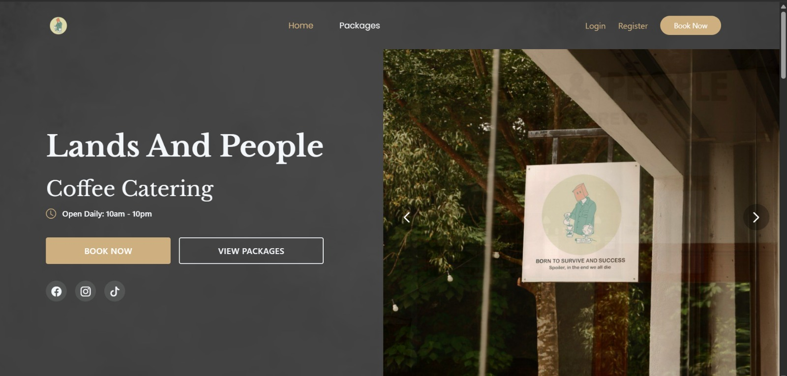
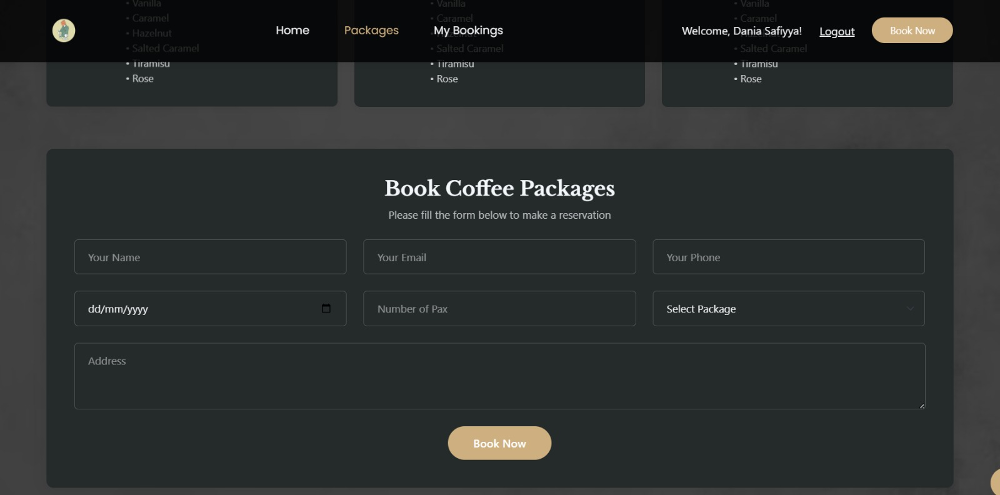

# Coffee Catering Reservation System

## Group Information
**Group Name**: Ruby
**Section**: 5
**Group Members** :
- HANI KHAIRANI BINTI MOHD RAZIF - 2319158
- DAHLIA CINTA BINTI ABDUL RAZAK - 2317562
- DANIA SAFIYYA BINTI FARID - 2310056
- HANIS BINTI AZHAR - 2312128

## Project Overview
The growth of small catering businesses has increased the need for an efficient reservation system, as many businesses still rely on manual bookings through phone calls or walk-ins. This often leads to issues such as lost reservations, pricing miscalculations and double bookings.

To address these problems, the Coffee Catering Reservation System was developed for Lands & People Cafe. This web-based system simplifies the reservation process by allowing users to choose predefined coffee catering packages based on their budget and event requirements.

---

##Project Objectives
The objectives of this system are:
1. To digitalize the reservation process by replacing manual phone-based booking with an online platform.
2. To provide users with a seamless reservation experience for selecting packages and entering event details.
3. To assist staff in managing reservations efficiently.
4. To enhance user satisfaction by enabling users to view, update, and cancel bookings.

---
## Target Users
- Customers : Individuals looking to book coffee catering
- Owners : Owners who want to manage bookings effectively digitally
- Administrators : System managers who oversee the platform

## Features and Functionalities
- Home page showcase: Display service offered such as professional baristas, fresh - ingredients, handcrafted drinks, event catering, and mobile coffee.
- Package display: Shows the fixed package coffee menu and pricing.
- Online reservation form: Let users input personal and event details.
- Date picker calendar: Allows users to select dates easily.
- Booking status page: Shows whether users have active bookings or not.
- Booking option button: Provides edit and cancel option for active booking.
- Update reservation form: Allows users to edit previous booking details.
- Cancellation confirmation popup: Asks confirmation cancel to avoid accidental cancellation.
- Navigation bar: Gives quick access to home, packages, my bookings and book now.
- Footer information: Provides location, social media links and contact details.

---
**Admin Features**

## Technical Implementation

---
** Database Design**

### Entity Relationship Diagram (ERD)

Key Relationships:

** Laravel Components Implementation**
- Routes (Web.php)
  
<?php

use App\Http\Controllers\BookingController;
use App\Models\Booking;

Route::get('/', function () {
    return view('home');
})->name('home');

// Move booking store route outside auth middleware (allow guests to submit, but check in controller)
Route::post('/bookings', [BookingController::class, 'store'])->name('bookings.store');

Route::middleware([
    'auth:sanctum',
    config('jetstream.auth_session'),
    'verified',
])->group(function () {
    // Other booking routes (protected - require login)
    Route::get('/bookings', [BookingController::class, 'index'])->name('bookings.index');
    Route::get('/bookings/{booking}/edit', [BookingController::class, 'edit'])->name('bookings.edit');
    Route::put('/bookings/{booking}', [BookingController::class, 'update'])->name('bookings.update');
    Route::delete('/bookings/{booking}', [BookingController::class, 'destroy'])->name('bookings.destroy');

    Route::get('/dashboard', function () {
        return view('dashboard');
    })->name('dashboard');

    Route::get('/packages', function () {
        return view('packages'); 
    })->name('packages');
});

- Controllers
  
  *Main Controllers Implemented are below :*
 1.BookingController :  

- Models and Relationships
//Booking Model
<?php

namespace App\Models;

use Illuminate\Database\Eloquent\Factories\HasFactory;
use Illuminate\Database\Eloquent\Model;

class Booking extends Model
{
    use HasFactory;

    protected $fillable = [
        'user_id',
        'name',
        'email',
        'phone',
        'date',
        'pax',
        'package_id',
        'address',
    ];

     protected $casts = [
        'date' => 'datetime', // Now $booking->date is a Carbon instance
    ];

    // Relationship: A booking belongs to a user
    public function user()
    {
       // return $this->belongsTo(Package::class);
          return $this->belongsTo(User::class);
    }
    
}
//Membership Model
<?php

namespace App\Models;

use Laravel\Jetstream\Membership as JetstreamMembership;

class Membership extends JetstreamMembership
{
    /**
     * Indicates if the IDs are auto-incrementing.
     *
     * @var bool
     */
    public $incrementing = true;
}
//Team Model
<?php

namespace App\Models;

use Illuminate\Database\Eloquent\Factories\HasFactory;
use Laravel\Jetstream\Events\TeamCreated;
use Laravel\Jetstream\Events\TeamDeleted;
use Laravel\Jetstream\Events\TeamUpdated;
use Laravel\Jetstream\Team as JetstreamTeam;

class Team extends JetstreamTeam
{
    /** @use HasFactory<\Database\Factories\TeamFactory> */
    use HasFactory;

    /**
     * The attributes that are mass assignable.
     *
     * @var array<int, string>
     */
    protected $fillable = [
        'name',
        'personal_team',
    ];

    /**
     * The event map for the model.
     *
     * @var array<string, class-string>
     */
    protected $dispatchesEvents = [
        'created' => TeamCreated::class,
        'updated' => TeamUpdated::class,
        'deleted' => TeamDeleted::class,
    ];

    /**
     * Get the attributes that should be cast.
     *
     * @return array<string, string>
     */
    protected function casts(): array
    {
        return [
            'personal_team' => 'boolean',
        ];
    }
}
//TeamInvitation Model
<?php

namespace App\Models;

use Illuminate\Database\Eloquent\Relations\BelongsTo;
use Laravel\Jetstream\Jetstream;
use Laravel\Jetstream\TeamInvitation as JetstreamTeamInvitation;

class TeamInvitation extends JetstreamTeamInvitation
{
    /**
     * The attributes that are mass assignable.
     *
     * @var array<int, string>
     */
    protected $fillable = [
        'email',
        'role',
    ];

    /**
     * Get the team that the invitation belongs to.
     */
    public function team(): BelongsTo
    {
        return $this->belongsTo(Jetstream::teamModel());
    }
}

//User Model
<?php

namespace App\Models;

// use Illuminate\Contracts\Auth\MustVerifyEmail;
use Illuminate\Database\Eloquent\Factories\HasFactory;
use Illuminate\Foundation\Auth\User as Authenticatable;
use Illuminate\Notifications\Notifiable;

class User extends Authenticatable
{
    /** @use HasFactory<\Database\Factories\UserFactory> */
    use HasFactory, Notifiable;

    /**
     * The attributes that are mass assignable.
     *
     * @var list<string>
     */
    protected $fillable = [
        'name',
        'email',
        'password',
    ];

    /**
     * The attributes that should be hidden for serialization.
     *
     * @var list<string>
     */
    protected $hidden = [
        'password',
        'remember_token',
    ];

    /**
     * Get the attributes that should be cast.
     *
     * @return array<string, string>
     */
    protected function casts(): array
    {
        return [
            'email_verified_at' => 'datetime',
            'password' => 'hashed',
        ];
    }
}

- Views and User Interface
*Blade Templates Structure:*
- dashboard.blade.php -
- home.blade.php -
- navigation-menu.php - 
- policy.blade.php -
- terms.blade.php -

 *Design Features:*
 - 
## User Authentication System
- 
### **Security Measures**
- 

## Installation and Setup Instructions
### Prerequisites :
- PHP >= 8.1
- Composer
- Node.js and NPM
- MySQL 8.0
- XAMPP 

---
### Step-by-Step Installation
1. Clone or download this repository
2. Open the project folder
3. Open `index.html` using any web browser

---
## Testing and Quality Assurance
###  Functionality Testing

### Browser Compatibility

### Performance Testing

## Challenges Faced and Solutions
### Challenge 1:

## Future Enhancements
### Phase 2 Features (Potential Improvements)
-
### Scalability Considerations
- 

## Learning Outcomes
### Technical Skills Gained
-
-
### Soft Skills Developed

## References
- Figma Prototype: Coffee Catering Reservation System
- Easy Eat. (2025). https://easyeat.ai/r/landsnpeople/2

## Conclusion

### Key Achievements

### Project Impact

## Screenshots

### Home Page

### Packages Page

### Reservation Form

### My Bookings Page

---

## Demo Consistency
The code implementation and functionalities in this repository fully reflect the project demonstrated during the presentation.

---
